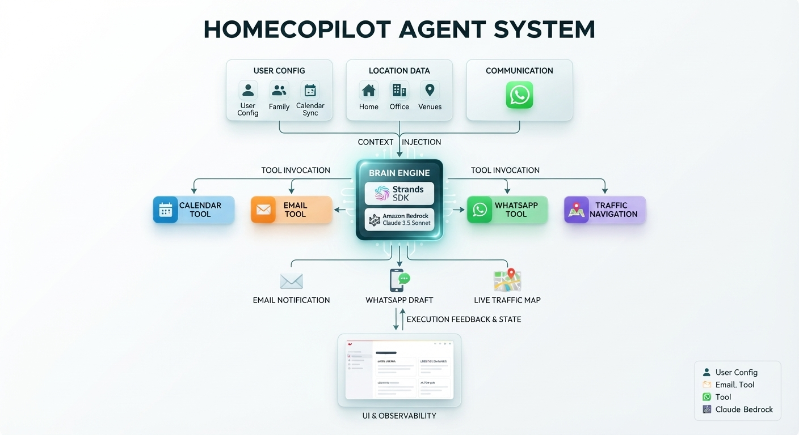

# HomeCopilot: Everyday Family Logistics Agent

## Strands Agents SDK + Amazon Bedrock

[](https://agentsforhumans.devpost.com/)
[](LICENSE)
[](https://github.com/strands-agents)

HomeCopilot is a human-supervised agent that turns a family's real schedule and an unexpected situation into an explainable logistics plan.

## Try HomeCopilot Online

The live application is available here: **[Open the HomeCopilot Web App](https://homecopilot.streamlit.app/)**

You can enter your own commitments, family activities, locations, travel estimate, and current situation directly in the browser.

## Problem

Families continuously reconcile work meetings, school pickup, activities, travel, and last-minute changes. The difficult part is deciding what should happen when several commitments become incompatible.

HomeCopilot addresses that decision problem. The user provides their own commitments, locations, family activities, travel estimate, and the situation happening now. The agent evaluates the constraints without inventing missing personal data.

## What It Does

- Accepts a real agenda using `time | activity | category` lines.
- Accepts free-form incidents such as a late meeting, a cancelled caregiver, or an impossible pickup.
- Evaluates the incident with the user's travel estimate and family modules.
- Offers supervised autopilot: detects complete context changes, calculates the route, and starts a new agent analysis automatically.
- Produces severity, cause, alternatives, recommendation, and approval-required actions.
- Creates a WhatsApp draft only when an activity has a name, venue address, and schedule.
- Blocks calendar, email, and WhatsApp actions when data or approval is missing.
- Shows an auditable decision cycle: context received, constraints evaluated, tool selected, plan ready, and approval status.
- Opens a Google Maps route for visual reference while keeping its estimate separate from the user's planning estimate.

## Agent Architecture

HomeCopilot is a human-in-the-loop agent, not a static chatbot:

1. **Context layer:** Streamlit collects the user's agenda, locations, modules, travel estimate, and current incident.
2. **Reasoning layer:** Strands `Agent` uses Claude on Amazon Bedrock to interpret the situation and select tools.
3. **Tool layer:** Custom `@tool` functions evaluate contingencies and prepare or modify actions.
4. **Decision layer:** The app records and displays an explainable plan.
5. **Approval layer:** Consequential actions remain blocked until the user approves the plan.
6. **Audit layer:** The decision trace and action log show what happened and why.

### Architecture Diagram



## Differentiator

HomeCopilot makes the path from personal context to an auditable decision visible. A reviewer can see what context was received, which constraints were evaluated, which tool was selected, what plan was produced, and whether a human approved it.

This combines agentic reasoning with deterministic guardrails: the model interprets open-ended situations, while the application refuses to create a WhatsApp action from incomplete family data or execute consequential actions without approval.

## Tech Stack

- **Python 3.10+**
- **Streamlit** for the user interface
- **Strands Agents SDK** for agent orchestration and tools
- **Amazon Bedrock** with `global.anthropic.claude-sonnet-4-6`
- **Google Maps Directions API** for origin-to-destination travel time
- **Google Maps embedded route** for visual route inspection
- **pandas**, `python-dotenv`, and AWS SDK dependencies

## Setup

### Prerequisites

- Python 3.10 or higher.
- An AWS account with access to the configured Amazon Bedrock model.
- AWS CLI configured locally.

### Step 1: Create a virtual environment
On Windows PowerShell:
```powershell
python -m venv venv
.\venv\Scripts\Activate.ps1
```

On macOS/Linux:
```bash
python -m venv venv
source venv/bin/activate
```

### Step 2: Install dependencies

```bash
pip install -r requirements.txt
```

### Step 3: Configure AWS credentials

```bash
aws configure
```

Create a `.env` file in the project root:

```env
AWS_REGION=us-east-1
```


## Run

```bash
streamlit run app.py
```

## Try It Online

### Published deployment

The current public deployment is running on Streamlit Community Cloud:

**[https://homecopilot.streamlit.app/](https://homecopilot.streamlit.app/)**

For a new deployment or a private fork, add the required secrets in the app settings. For an AWS access-key deployment, use:

```toml
AWS_REGION = "us-east-1"
AWS_ACCESS_KEY_ID = "..."
AWS_SECRET_ACCESS_KEY = "..."
GOOGLE_MAPS_API_KEY = "..."
```

The Google key must have the **Directions API** enabled and billing configured in Google Cloud. Use an IAM identity limited to the required Bedrock model permissions. Never commit `.env` or `.streamlit/secrets.toml`.

### Run with Docker

Build and start the web app locally:

```bash
docker build -t homecopilot .
docker run --rm -p 8501:8501 --env-file .env homecopilot
```

Open [http://localhost:8501](http://localhost:8501). The container listens on port `8501` and includes the architecture image used by the README.

## Real User Flow

1. Enter your own commitments in the sidebar, one per line using `time | activity | category`.
2. Add home/work locations, family modules, and a travel estimate. A family module needs a name, venue address, and schedule before it can produce a WhatsApp draft.
3. Describe what is happening now in **Your real situation today**, for example: `My meeting ran 30 minutes over and I need to pick up my child.`
4. HomeCopilot detects the completed context and automatically starts the analysis.
5. Review the diagnosis, alternatives, decision trace, severity, and recommended plan.
6. Approve the plan before using calendar or WhatsApp actions.

To demonstrate the agentic workflow, enable **Supervised autopilot** in the sidebar. Once the email/calendar context, origin, agenda or incident, and route information are complete, HomeCopilot detects context changes and starts the analysis automatically. External actions still remain behind the human approval gate.

The application does not invent calendar events, family members, addresses, or schedules.

## Safety and Trust

- User context is treated as the source of truth.
- Missing information produces a blocked action instead of a generic message.
- Email, calendar, and WhatsApp tools are approval-gated.
- The decision trace and action log make agent behavior inspectable.
- The user's travel estimate and Google Maps' route estimate are labelled separately.

## Current Integration Boundary

The current hackathon build uses local tool implementations and Streamlit session state for calendar, email, and WhatsApp actions. They demonstrate the agent contract and approval flow, but they do not claim to send real email, modify an external calendar, or send a real WhatsApp message. Route time is calculated through the Google Maps Directions API when `GOOGLE_MAPS_API_KEY` is configured; the embedded map provides visual route inspection.


## License
This project is open-source under the [MIT License](LICENSE).
